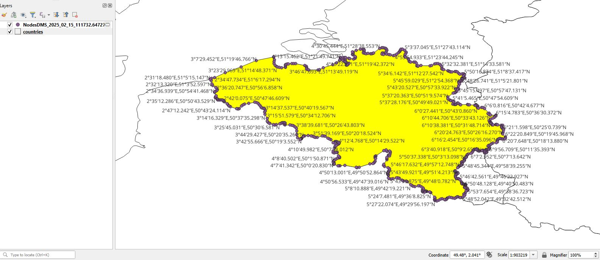

# PolygonNodesToDMS

QGIS Plugin to add labels with coordinates in DMS (degrees, minutes, seconds) format to the polygon/multipolygon nodes (vertices)

- [Installation](#installation)
  - [Git user](#git_user)
  - [No Git user](#no_git_user)
- [Input/output data](#input_output)
- [Usage](#usage)

# Installation <a name=installation>

## For Git users <a name=git_user>

1. Copy repository to the local disk
2. cd dir to the main dir of the qgis3-polygon-nodes-to-dms repository
3. Create zip file from the polygon_nodes_to_dms subdirectory
4. QGIS - install plugin via Plugin manager/Installer  
   4.1 Open menu: `Plugins > Manage and Install Plugins`  
   4.2 Choose `Install from ZIP`  
   4.3 Select zip file `polygon_nodes_to_dms.zip`  
   4.4 Press `Install Plugin button` 
5. Plugin is installed: `Plugins > PolygonNodesToDMS`

## For not Git users <a name=no_git_user>

1. Download repository via `Code > Download ZIP`
2. Unzip to `qgis3-polygon-nodes-to-dms-master` directory
3. cd dir to the unzipped directory
4. Create zip file from the polygon_nodes_to_dms subdirectory
5. QGIS - install plugin via Plugin manager/Installer  
   5.1 Open menu: `Plugins > Manage and Install Plugins`   
   5.2 Choose `Install from ZIP`  
   5.3 Select zip `polygon_nodes_to_dms.zip`  
   5.4 Press `Install Plugin button`  
6. Plugin is installed: `Plugins > PolygonNodesToDMS`

# Input/output data <a name=input_output>

## Input
  * layer with geometry type:Polygon/MultiPolygon
  * one feature must be selected

## Output

* memory type layer with generate DMS nodes coordinates
* layer name format: `NodesDMS_<timestamp>`
  * where `<timestamp>` is in format: `<YYYY>_<MM>_<DD>_<HH><MM>`
    * YYYY - year
    * MM - month
    * DD - day of month
    * HH - hour
    * MM - minutes

# Usage <a name=usage>

1. Select polygon/multipolygon for which you want to add nodes labels with DMS
2. Open plugin: `Plugins > PolygonNodesToDMS`
3. Choose Coordinate order:
4. Press `Show nodes` button

5. Labels witch coordinates added

